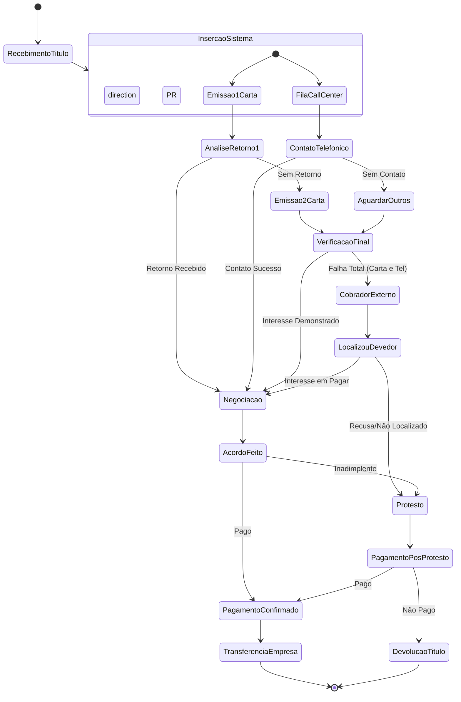

# Projeto: Sistema Integrado de Recuperação de Crédito (SIRC)

Este projeto apresenta a proposta de otimização de um fluxo de cobrança empresarial, substituindo processos manuais por uma abordagem automatizada e multicanal. O foco é aumentar a eficiência na recuperação de ativos e reduzir custos operacionais.

## 📌 Contexto do Processo
O fluxo original baseava-se em envios de cartas físicas e contatos telefônicos manuais. A nova proposta integra essas frentes e adiciona camadas de automação, escalonamento inteligente para cobrança externa e integração com serviços de protesto.

---

## 📊 Fluxo de Processo (Diagrama de Atividades)

O diagrama abaixo, construído em **Mermaid**, descreve a lógica do sistema, desde o recebimento do título até a finalização (pagamento, devolução ou protesto).

---

## 🛠️ Requisitos do Sistema

### Requisitos Funcionais (RF)
* **RF01:** Importação automatizada de títulos via API ou CSV.
* **RF02:** Disparo de notificações via WhatsApp, E-mail e SMS (Substitutos da 1ª e 2ª carta).
* **RF03:** Gerenciamento de fila de discagem para o Call Center.
* **RF04:** Módulo de autoatendimento (Portal do Devedor) para geração de boletos.
* **RF05:** Integração com birôs de crédito e cartórios para automação de protestos.

### Requisitos Não Funcionais (RNF)
* **RNF01:** Conformidade total com a LGPD (Lei Geral de Proteção de Dados).
* **RNF02:** Disponibilidade de 99.9% (Sistema crítico).
* **RNF03:** Escalabilidade para processar grandes volumes de títulos simultaneamente.

---

## 📑 Regras de Negócio
1.  **Paralelismo:** As ações de notificação digital e cobrança telefônica devem ocorrer de forma independente e simultânea.
2.  **Escalonamento:** O acionamento do cobrador externo é o último recurso antes do protesto judicial/extrajudicial.
3.  **Liquidação:** Qualquer pagamento identificado deve interromper automaticamente o fluxo de cobrança e gerar a transferência à contratante em $D+1$.

---

## 🚀 Tecnologias Sugeridas
* **Backend:** Node.js ou Python (FastAPI).
* **Frontend:** React.js (Painel Administrativo e Portal do Devedor).
* **Banco de Dados:** PostgreSQL.
* **Comunicação:** Twilio API (WhatsApp/SMS) e SendGrid (E-mail).

---
**Desenvolvido como parte dos estudos de Modelagem de Sistemas (UML).**
