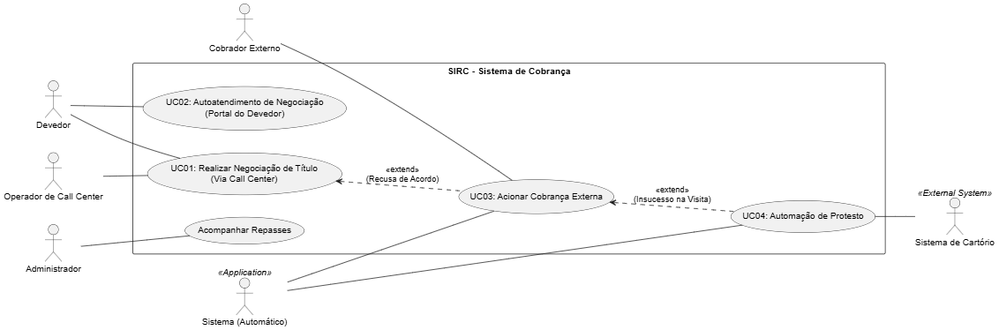

# Diagramas de Casos de Uso - SIRC

Estes diagramas representam as interações entre os atores e as funcionalidades do Sistema Integrado de Recuperação de Crédito.

---

## 1. Diagrama Geral (Visão do Sistema)

Este diagrama apresenta uma visão macro de como todos os atores interagem com os módulos principais do sistema.

